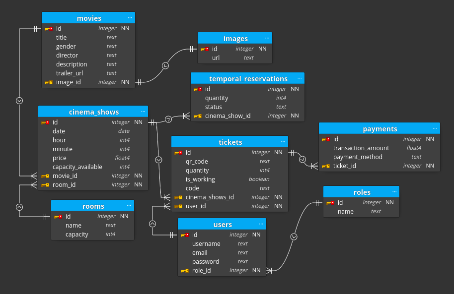

# FlicksSpot

## Diagrama de entidad relación



## Instrucciones

- Instalar las dependencias

```bash
  npm i 
```

- Asignar las variables de entorno en el archivo **.env**

- Iniciar el contenedor de Docker

```bash
  docker compose up -d
```

- Ejecutar SEED:
  - Crea los roles, el usuario administrador y las salas.

```bash
  npm run db:seed
```

- Iniciar la aplicación:

```bash
  npm run dev
```
